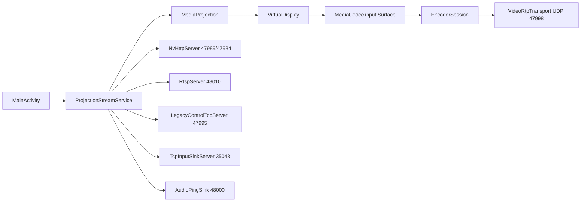

# Apsu Android GameStream Server

## Resumen

Apsu es una app Android nueva en `C:\Proyectos\apsu-android` para actuar como servidor GameStream compatible con clientes tipo Moonlight/Artemis. No es un fork directo de Apollo: Apollo/Sunshine se usan como referencia de protocolo, porque reutilizar codigo directo traeria GPLv3 y porque sus backends estan pensados para escritorio.

El APK debug actual es instalable y arranca un servidor MVP con captura Android sin root, encoder hardware obligatorio H.264/HEVC, pairing NVHTTP, RTSP, RTP de video y un perfil de compatibilidad legacy para evitar el control stream ENet cifrado de las generaciones modernas de Moonlight.

## Entorno local

- Workspace: `C:\Proyectos\apsu-android`
- Android Studio: `C:\Program Files\Android\Android Studio\bin`
- Android SDK: `C:\Users\CJF\AppData\Local\Android\Sdk`
- SDK instalado: API 35, 36 y 36.1
- NDK instalado: `27.3.13750724`
- CMake SDK: `3.22.1`
- Gradle: wrapper local del proyecto
- APK debug: `C:\Proyectos\apsu-android\app\build\outputs\apk\debug\app-debug.apk`
- Debug signing: Gradle usa la keystore estandar `C:\Users\CJF\.android\debug.keystore`
- Release signing local: hay keystore en `C:\Users\CJF\.android`; no se sube al repo ni se documentan passwords

## Estado implementado

- Proyecto Android Kotlin + NDK con `compileSdk`/`targetSdk` 36.
- UI programatica sin AndroidX en `MainActivity`.
- Foreground service `ProjectionStreamService` con tipo `mediaProjection`.
- `PARTIAL_WAKE_LOCK` mientras el streaming esta activo para evitar reposo durante sesiones largas.
- Captura directa: `MediaProjection -> VirtualDisplay -> MediaCodec input Surface`.
- Encoder hardware obligatorio:
  - H.264: `video/avc`
  - HEVC: `video/hevc`
  - seleccion via `MediaCodecList`
  - filtro `isEncoder && isHardwareAccelerated && !isSoftwareOnly`
  - rechazo de `c2.android.*`, `OMX.google.*` y nombres software
  - prioridad Snapdragon/Qualcomm: `c2.qti.*`, `OMX.qcom.*`, `qti`, `qcom`, `qualcomm`
- Controles visibles:
  - codec: Auto, H.264, HEVC
  - resolucion: 720p, 1080p, 1440p
  - FPS: 30, 45, 60, 90, 120
  - bitrate manual en Mbps
  - audio capture on/off
- Baja latencia:
  - `COLOR_FormatSurface`
  - CBR si el encoder lo soporta
  - `KEY_LOW_LATENCY = 1` en Android R+
  - `KEY_MAX_B_FRAMES = 0` en Android Q+
  - GOP corto de 1 segundo
  - IDR inicial y respuesta a peticiones IDR de cliente
- Protocolo GameStream MVP:
  - NVHTTP en TCP `47989`
  - HTTPS en TCP `47984`
  - RTSP en TCP `48010`
  - Video RTP en UDP `47998`
  - Audio ping sink en UDP `48000`
  - Control legacy en TCP `47995`
  - Input legacy sink en TCP `35043`
- Pairing:
  - certificado self-signed via AndroidKeyStore
  - flujo `getservercert`, `clientchallenge`, `serverchallengeresp`, `clientpairingsecret`, `pairchallenge`
  - SHA-1 para perfil legacy generation 4
  - SHA-256 disponible en el codigo para perfiles modernos
- Video RTP:
  - recibe ping UDP del cliente y fija peer
  - empaqueta frames `EncodedFrame` como RTP/NV video packets
  - lee `x-nv-video[0].packetSize` del `ANNOUNCE` RTSP y adapta el payload a 1024/1392 segun cliente
  - convierte NAL length-prefixed a Annex B cuando hace falta
  - prepende SPS/PPS/VPS a keyframes desde `csd-*`
  - H.264 y HEVC usan Annex B para Moonlight

## Perfil de compatibilidad elegido

El servidor anuncia:

- `appversion`: `4.1.1.0`
- `GfeVersion`: `2.11.4.0`

La razon es practica. Con `appversion 7.1.431.0`, Moonlight usa control stream ENet y control cifrado AES-GCM. Implementar un servidor ENet completo en Kotlin/Android para el MVP subiria mucho el alcance y bloquearia una prueba real. Con generation 4, Moonlight usa:

- pairing SHA-1
- RTSP por TCP
- control por TCP `47995`
- input por TCP `35043`
- video sin frame header moderno

Esto deja un APK mas testeable ahora. El soporte de encoder HEVC sigue existiendo y se anuncia en SDP con el marcador que Moonlight usa para detectar H.265, pero la ruta que primero debe validarse manualmente es H.264 1080p60.

## Flujo de uso

1. Instalar `app-debug.apk`.
2. Abrir Apsu GameStream en el Android servidor.
3. Elegir H.264, 1080p, 60 FPS y bitrate 16 Mbps para la primera prueba.
4. Pulsar `Start server`.
5. Aceptar el permiso de captura de pantalla.
6. En Moonlight/Artemis, agregar el host usando la IP mostrada en la app.
7. Introducir el PIN mostrado por la app cuando Moonlight lo pida.
8. Lanzar `Android Screen`.

## Limitaciones reales del APK actual

- No hay validacion runtime todavia: no hay dispositivo ADB conectado en este entorno.
- El control/input remoto se acepta para que Moonlight no falle, pero se ignora; no inyecta tactil, mando, teclado ni raton en Android.
- Audio de red no esta implementado. La app puede capturar PCM local con `AudioPlaybackCaptureConfiguration`, pero aun no codifica Opus ni envia RTP audio. Si Android niega o bloquea la captura de audio, el video continua.
- No hay FEC ni retransmision avanzada en video.
- No hay RTSP cifrado ni control stream ENet moderno.
- La compatibilidad HEVC con Moonlight debe probarse en dispositivo real; el encoder hardware y el SDP estan implementados, pero el primer objetivo de interoperabilidad es H.264.
- La emision empieza al iniciar el servicio y descarta frames hasta recibir el ping UDP de video del cliente.

## Arquitectura

## Clases principales

- `MainActivity.kt`: UI, seleccion de parametros, permiso `MediaProjection`.
- `StreamConfig.kt`: codec, resolucion, FPS, bitrate, audio y baja latencia.
- `EncoderSelector.kt`: seleccion y validacion de encoder hardware.
- `EncoderSession.kt`: configuracion `MediaCodec`, salida Annex B y keyframes con CSD.
- `ProjectionStreamService.kt`: lifecycle de captura, encoder y servidores.
- `NvHttpServer.kt`: endpoints `serverinfo`, `applist`, `pair`, `launch`, `resume`, `cancel`, `pin`.
- `RtspServer.kt`: `OPTIONS`, `DESCRIBE`, `SETUP`, `ANNOUNCE`, `PLAY`, `TEARDOWN`.
- `VideoRtpTransport.kt`: RTP/NV video packetization.
- `LegacyControlTcpServer.kt`: ACK simple a paquetes de control generation 3/4 e IDR request.
- `TcpInputSinkServer.kt`: acepta y drena input legacy.
- `AudioPingSink.kt`: recibe pings UDP de audio para evitar errores de puerto cerrado.
- `PairingProtocol.kt`: pairing GameStream SHA-1/SHA-256.
- `ServerIdentity.kt`: identidad TLS/certificado de servidor.

## Test plan

- Build local:
  - `.\gradlew.bat assembleDebug testDebugUnitTest`
- Instalacion manual:
  - `C:\Users\CJF\AppData\Local\Android\Sdk\platform-tools\adb.exe install -r app\build\outputs\apk\debug\app-debug.apk`
- Prueba principal:
  - H.264 1080p60 16 Mbps en Snapdragon.
  - Pairing desde Moonlight.
  - Launch de `Android Screen`.
  - Confirmar primer frame antes de 10 segundos.
- Prueba HEVC:
  - HEVC 1080p60 si `Check hardware encoder` acepta el encoder.
  - Verificar que Moonlight negocia H.265 y recibe IDR con VPS/SPS/PPS.
- Pruebas negativas:
  - seleccionar HEVC en un dispositivo sin encoder HEVC hardware debe fallar antes de iniciar.
  - seleccionar FPS/resolucion fuera de capacidades debe fallar antes de iniciar.

## Referencias

- Apollo: https://github.com/ClassicOldSong/Apollo
- Moonlight common-c: https://github.com/moonlight-stream/moonlight-common-c
- Moonlight Android PairingManager: https://github.com/moonlight-stream/moonlight-android/blob/master/app/src/main/java/com/limelight/nvstream/http/PairingManager.java
- Android MediaProjection: https://developer.android.com/media/grow/media-projection
- Android MediaCodec: https://developer.android.com/reference/android/media/MediaCodec
- Android MediaCodecInfo: https://developer.android.com/reference/android/media/MediaCodecInfo
- Android AudioPlaybackCaptureConfiguration: https://developer.android.com/reference/android/media/AudioPlaybackCaptureConfiguration
