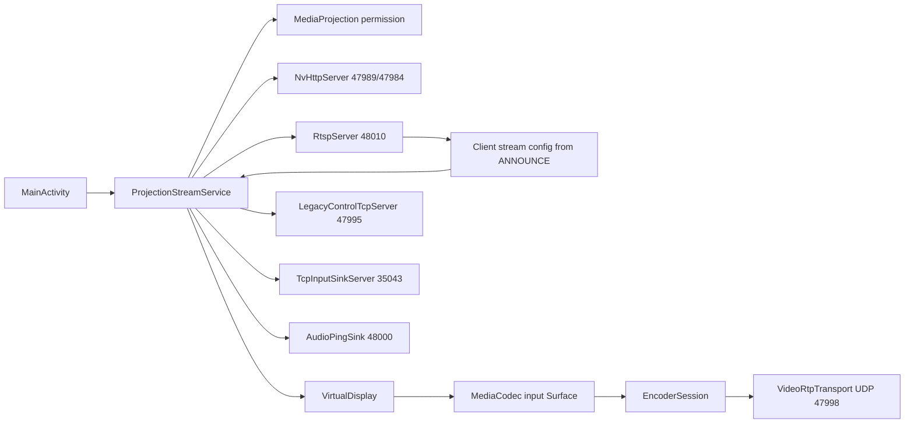

# Apsu Android GameStream Server

## Resumen

Apsu es una app Android nueva en `C:\Proyectos\apsu-android` para actuar como servidor GameStream compatible con clientes tipo Moonlight/Artemis. No es un fork directo de Apollo: Apollo/Sunshine se usan como referencia de protocolo, porque reutilizar codigo directo traeria GPLv3 y porque sus backends estan pensados para escritorio.

El APK debug actual es instalable y arranca un servidor MVP con captura Android sin root, encoder hardware obligatorio H.264/HEVC, pairing NVHTTP, RTSP, RTP de video y un perfil de compatibilidad legacy para evitar el control stream ENet cifrado de las generaciones modernas de Moonlight.

## Entorno local

- Workspace: `C:\Proyectos\apsu-android`
- Android Studio: `C:\Program Files\Android\Android Studio\bin`
- Android SDK: `C:\Users\CJF\AppData\Local\Android\Sdk`
- SDK instalado: API 35, 36 y 36.1
- NDK instalado: `27.3.13750724`
- CMake SDK: `3.22.1`
- Gradle: wrapper local del proyecto
- APK debug: `C:\Proyectos\apsu-android\app\build\outputs\apk\debug\app-debug.apk`
- Debug signing: Gradle usa la keystore estandar `C:\Users\CJF\.android\debug.keystore`
- Release signing local: hay keystore en `C:\Users\CJF\.android`; no se sube al repo ni se documentan passwords

## Estado implementado

- Proyecto Android Kotlin + NDK con `compileSdk`/`targetSdk` 36.
- UI programatica sin AndroidX en `MainActivity`.
- Foreground service `ProjectionStreamService` con tipo `mediaProjection`.
- `PARTIAL_WAKE_LOCK` mientras el streaming esta activo para evitar reposo durante sesiones largas.
- Captura directa: `MediaProjection -> VirtualDisplay -> MediaCodec input Surface`.
- Arranque diferido del pipeline: aceptar `MediaProjection` solo deja el host en `READY`; `VirtualDisplay` y `MediaCodec` se crean cuando Moonlight/Artemis lanza una app y envia la configuracion real por RTSP `ANNOUNCE`.
- Configuracion guiada por cliente:
  - el host parsea `x-nv-video[0].clientViewportWd`, `clientViewportHt`, `maxFPS`, `packetSize`, bitrates `initialBitrateKbps`/`configuredBitrateKbps`/VQOS y `x-nv-vqos[0].bitStreamFormat`.
  - resolucion, FPS y bitrate efectivos vienen del cliente cuando estan presentes.
  - los controles de la app son fallback/anuncio inicial, no el valor forzado de la sesion.
  - si el cliente pide una combinacion no soportada por encoder hardware, el servidor rechaza `ANNOUNCE` con error RTSP en vez de quedar cargando.
- Encoder hardware obligatorio:
  - H.264: `video/avc`
  - HEVC: `video/hevc`
  - seleccion via `MediaCodecList`
  - filtro `isEncoder && isHardwareAccelerated && !isSoftwareOnly`
  - rechazo de `c2.android.*`, `OMX.google.*` y nombres software
  - prioridad Snapdragon/Qualcomm: `c2.qti.*`, `OMX.qcom.*`, `qti`, `qcom`, `qualcomm`
- Controles visibles:
  - fallback codec: Auto, H.264, HEVC
  - fallback resolucion: 720p, 1080p, 1440p
  - fallback FPS: 30, 45, 60, 90, 120
  - fallback bitrate manual en Mbps
  - audio capture on/off, desactivado por defecto hasta implementar RTP audio real
  - persistencia local de codec, resolucion, FPS, bitrate y audio
  - migracion de ajustes antiguos HEVC/bitrate alto hacia H.264 1080p60 16 Mbps como perfil de compatibilidad inicial
  - logs recientes visibles dentro de la app
  - mantenimiento: limpiar pairings y regenerar identidad/certificado del host
  - estado de cliente activo detectado por actividad NVHTTP/RTSP/RTP/control
- Baja latencia:
  - `COLOR_FormatSurface`
  - CBR si el encoder lo soporta
  - `KEY_LOW_LATENCY = 1` en Android R+
  - `KEY_MAX_B_FRAMES = 0` en Android Q+
  - `KEY_REPEAT_PREVIOUS_FRAME_AFTER` para mantener flujo continuo aunque Android solo entregue frames cuando hay cambios visuales
  - `KEY_PREPEND_HEADER_TO_SYNC_FRAMES = 1` y peticion IDR periodica cada segundo para recuperacion de clientes ante perdida de referencia
  - GOP corto de 1 segundo
  - IDR inicial y respuesta a peticiones IDR de cliente
  - deteccion de IDR por NAL H.264/HEVC, no solo por `MediaCodec.BufferInfo.flags`, para reinyectar SPS/PPS/VPS aunque encoders Qualcomm no marquen keyframe
- Protocolo GameStream MVP:
  - NVHTTP en TCP `47989`
  - HTTPS en TCP `47984`
  - RTSP en TCP `48010`
  - Video RTP en UDP `47998`
  - Audio ping sink en UDP `48000`
  - Control legacy en TCP `47995`
  - Input legacy sink en TCP `35043`
  - anuncio mDNS `_nvstream._tcp` en el puerto `47989`
  - `/applist` anuncia `Desktop` y `Android Screen` con XML compacto compatible con el parser de Moonlight/Artemis
  - `/appasset` devuelve un PNG minimo para evitar bloqueos de clientes que pidan portada tras leer la lista
  - `/launch`, `/resume` y `/cancel` actualizan `currentgame` para que el cliente vea estado basico de sesion
  - `/launch` acepta parametros de modo si algun cliente los envia y los deja como contexto preliminar para RTSP, pero no arranca el encoder; la configuracion efectiva y el inicio del pipeline se hacen en RTSP `ANNOUNCE`
- Pairing:
  - certificado self-signed via AndroidKeyStore
  - `uniqueid` persistente en preferencias locales para que Artemis/Moonlight no trate cada arranque como un host nuevo
  - flujo `getservercert`, `clientchallenge`, `serverchallengeresp`, `clientpairingsecret`, `pairchallenge`
  - el PIN lo define el cliente Moonlight/Artemis; la app Android host debe usar ese PIN activo antes de `getservercert`
  - si `getservercert` llega sin PIN activo, el servidor mantiene la peticion abierta hasta 90 segundos para que el usuario escriba el PIN mostrado por Artemis/Moonlight
  - TLS no solicita certificado de cliente para evitar que Android rechace certificados self-signed de Artemis antes de completar NVHTTP; la validacion criptografica se mantiene dentro del pairing
  - `plaincert` se devuelve como certificado PEM codificado en hex para compatibilidad con Moonlight iOS; el certificado TLS real sigue siendo DER y debe coincidir byte a byte tras convertir PEM a DER
  - la UI permite introducir el PIN mostrado por Artemis/Moonlight y el endpoint `/pin?pin=1234` tambien puede actualizarlo
  - SHA-1 para perfil legacy generation 4
  - SHA-256 disponible en el codigo para perfiles modernos
- Video RTP:
  - recibe ping UDP del cliente y fija peer
  - empaqueta frames `EncodedFrame` como RTP/NV video packets
  - mantiene separados el RTP sequence de 16 bits y `NV_VIDEO_PACKET.streamPacketIndex` de 24 bits; el segundo debe sobrevivir al wrap de 65k paquetes para evitar congelados alrededor de un minuto
  - genera RTP timestamps desde `frameIndex` y FPS negociado, no desde PTS del encoder, para evitar irregularidades de `MediaCodec` con frames repetidos
  - lee `x-nv-video[0].packetSize` del `ANNOUNCE` RTSP y adapta el payload a 1024/1392 segun cliente
  - convierte NAL length-prefixed a Annex B cuando hace falta
  - prepende SPS/PPS/VPS a keyframes desde `csd-*`
  - H.264 y HEVC usan Annex B para Moonlight

## Perfil de compatibilidad elegido

El servidor anuncia:

- `appversion`: `4.1.1.0`
- `GfeVersion`: `2.11.4.0`

La razon es practica. Con `appversion 7.1.431.0`, Moonlight usa control stream ENet y control cifrado AES-GCM. Implementar un servidor ENet completo en Kotlin/Android para el MVP subiria mucho el alcance y bloquearia una prueba real. Con generation 4, Moonlight usa:

- pairing SHA-1
- RTSP por TCP
  - control por TCP `47995`
  - input por TCP `35043`
  - video sin frame header moderno

Esto deja un APK mas testeable ahora. El soporte de encoder HEVC sigue existiendo y se anuncia en SDP con el marcador que Moonlight usa para detectar H.265 solo cuando el fallback de la app esta en HEVC. En modo Auto, el host anuncia H.264 por defecto porque HEVC ya produce flujo continuo en Snapdragon pero aun congela Moonlight iPad en la ruta legacy actual.
Si un cliente muestra `conexion lenta al PC`, la primera prueba debe volver a H.264 1080p60 16 Mbps con audio desactivado; los logs `Sent video frame...` confirman que el host esta enviando UDP al peer.
Si la imagen se congela pero el servicio sigue en foreground y los logs siguen mostrando `Encoded frame`/`Sent video frame`, no es un problema de app en segundo plano: normalmente indica que el cliente perdio referencia y necesita un IDR valido con SPS/PPS/VPS.

## Flujo de uso

1. Instalar `app-debug.apk`.
2. Abrir Apsu GameStream en el Android servidor.
3. Dejar `Fallback codec` en Auto o elegir H.264 para una primera prueba conservadora.
4. Pulsar `Start host`.
5. Aceptar el permiso de captura de pantalla.
6. En Moonlight/Artemis, agregar el host usando la IP mostrada en la app.
7. En Artemis/Moonlight, iniciar pairing y leer el PIN de 4 digitos que muestra el cliente.
8. En Apsu, escribir ese PIN en `Pairing PIN shown by Artemis/Moonlight` y pulsar `Use pairing PIN`.
9. Confirmar el pairing en Artemis/Moonlight y lanzar `Android Screen`.
10. Elegir resolucion, FPS, bitrate y codec desde Moonlight/Artemis; el host validara esa peticion contra `MediaCodecList` antes de arrancar captura.

## Limitaciones reales del APK actual

- Validado en Odin 2 Portal por ADB para arranque de servicio, puertos NVHTTP/RTSP/RTP y encoder Qualcomm H.264.
- El control/input remoto se acepta para que Moonlight no falle, pero se ignora; no inyecta tactil, mando, teclado ni raton en Android.
- Audio de red no esta implementado. La app puede capturar PCM local con `AudioPlaybackCaptureConfiguration`, pero aun no codifica Opus ni envia RTP audio. Si Android niega o bloquea la captura de audio, el video continua.
- No hay FEC ni retransmision avanzada en video.
- No hay RTSP cifrado ni control stream ENet moderno.
- La compatibilidad HEVC con Moonlight debe probarse en dispositivo real; el encoder hardware y el SDP estan implementados, pero el primer objetivo de interoperabilidad es H.264.
- El host no empieza a codificar al iniciar el servicio; espera `ANNOUNCE`. Si el cliente no llega a RTSP, no habra frames ni carga de encoder.

## Pendiente por implementar

- Completar interoperabilidad estable con Artemis/Moonlight: pairing, lista de apps, launch, RTSP y primer frame sin workarounds manuales.
- Audio de red real: codificar Opus y enviar RTP audio en vez de solo mantener abierto el puerto/ping.
- Input remoto: traducir mando, teclado, raton y tactil del cliente a eventos Android cuando sea viable sin root.
- Control stream moderno: implementar ENet/AES-GCM para perfiles GameStream recientes en vez de depender del perfil legacy TCP.
- FEC/retransmision y control de congestion para video RTP.
- Perfil HEVC validado extremo a extremo, incluido fallback claro a H.264 si el cliente o encoder falla.
- Pruebas instrumentadas reales para TLS/NVHTTP/RTSP y creacion de encoder con `COLOR_FormatSurface`.
- Pulido visual: UI OLED oscura inspirada en Moonlight, ya iniciada en `MainActivity`, con componentes propios sin AndroidX.

## Arquitectura

## Clases principales

- `MainActivity.kt`: UI, fallback de parametros, permiso `MediaProjection`.
- `ClientStreamConfig.kt`: parser de configuracion enviada por `/launch` y RTSP `ANNOUNCE`.
- `StreamConfig.kt`: codec, resolucion, FPS, bitrate, audio y baja latencia.
- `EncoderSelector.kt`: seleccion y validacion de encoder hardware.
- `EncoderSession.kt`: configuracion `MediaCodec`, salida Annex B y keyframes con CSD.
- `ProjectionStreamService.kt`: lifecycle de captura, encoder y servidores.
- `NvHttpServer.kt`: endpoints `serverinfo`, `applist`, `pair`, `launch`, `resume`, `cancel`, `pin`.
- `RtspServer.kt`: `OPTIONS`, `DESCRIBE`, `SETUP`, `ANNOUNCE`, `PLAY`, `TEARDOWN`.
- `VideoRtpTransport.kt`: RTP/NV video packetization.
- `LegacyControlTcpServer.kt`: ACK simple a paquetes de control generation 3/4 e IDR request.
- `TcpInputSinkServer.kt`: acepta y drena input legacy.
- `AudioPingSink.kt`: recibe pings UDP de audio para evitar errores de puerto cerrado.
- `PairingProtocol.kt`: pairing GameStream SHA-1/SHA-256.
- `ServerIdentity.kt`: identidad TLS/certificado de servidor.

## Test plan

- Build local:
  - `.\gradlew.bat assembleDebug testDebugUnitTest`
- Instalacion manual:
  - `C:\Users\CJF\AppData\Local\Android\Sdk\platform-tools\adb.exe install -r app\build\outputs\apk\debug\app-debug.apk`
- Prueba principal:
  - H.264 1080p60 16 Mbps configurado desde Moonlight/Artemis en Snapdragon.
  - Pairing desde Moonlight.
  - Launch de `Android Screen`.
  - Confirmar primer frame antes de 10 segundos.
- Prueba HEVC:
  - HEVC 1080p60 configurado desde Moonlight/Artemis si `Check fallback encoder` acepta HEVC o el host esta en Auto con HEVC disponible.
  - Verificar que Moonlight negocia H.265 y recibe IDR con VPS/SPS/PPS.
- Pruebas negativas:
  - seleccionar HEVC en un dispositivo sin encoder HEVC hardware debe fallar antes de iniciar.
  - seleccionar FPS/resolucion fuera de capacidades debe fallar antes de iniciar.
  - emparejar desde Moonlight iOS/iPadOS debe completar la fase HTTPS `pairchallenge` sin error de certificado del servidor.

## Referencias

- Apollo: https://github.com/ClassicOldSong/Apollo
- Moonlight common-c: https://github.com/moonlight-stream/moonlight-common-c
- Moonlight Android PairingManager: https://github.com/moonlight-stream/moonlight-android/blob/master/app/src/main/java/com/limelight/nvstream/http/PairingManager.java
- Android MediaProjection: https://developer.android.com/media/grow/media-projection
- Android MediaCodec: https://developer.android.com/reference/android/media/MediaCodec
- Android MediaCodecInfo: https://developer.android.com/reference/android/media/MediaCodecInfo
- Android AudioPlaybackCaptureConfiguration: https://developer.android.com/reference/android/media/AudioPlaybackCaptureConfiguration
